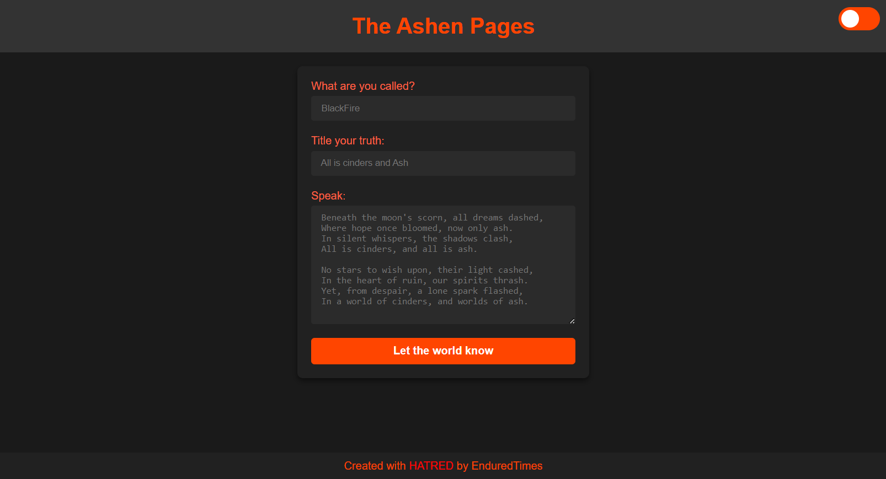
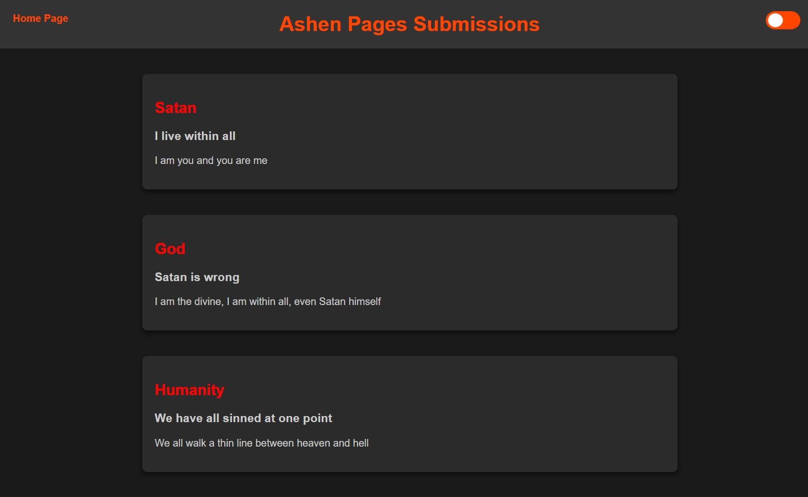

# The Ashen Pages

## Overview
The Ashen Pages is a thematic blog where users can submit and view poetic posts. It features dynamic theme switching and local storage-based post management.

## Screenshots

##

## Features
- Blog Post Submission: Users can submit posts via a form.
- Post Display: Posts are displayed on the home page dynamically.
- Theme Switching: Users can toggle between a light and dark theme.
- Form Validation: Ensures all form fields are filled before submission.

## Technologies Used
- HTML5
- CSS3
- JavaScript
- Local Storage

## Setup
To run this project, install it locally:
1. Clone the repository.
2. Open `index.html` in your browser.

##